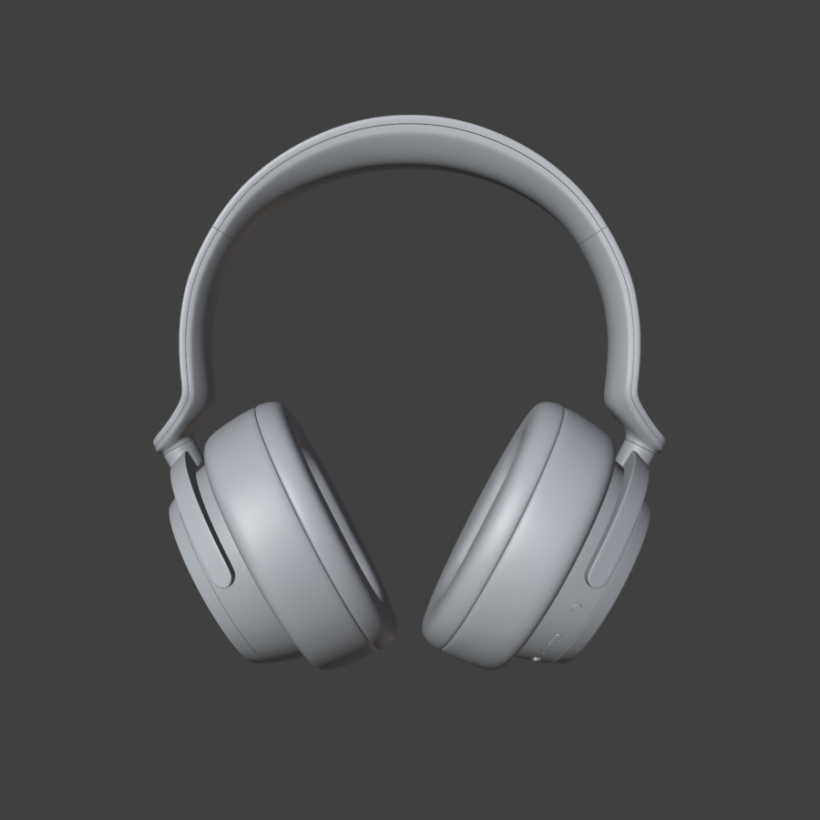
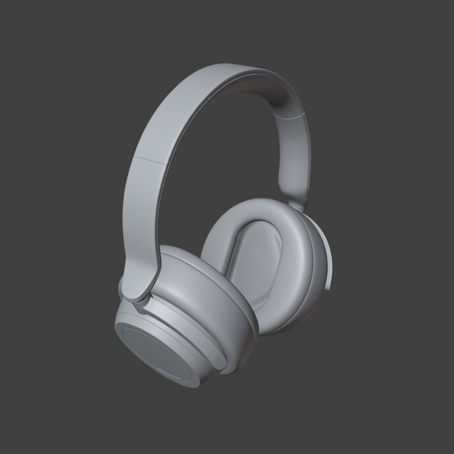

# `capstone.blend` — 3D Visualisation of the EEG Headband

This directory holds a single Blender file, `capstone.blend`, which is the 3D visualisation of the
capstone EEG headband concept. The scene combines two very different things:

- an **imported, third-party headphone model** (Microsoft Surface Headphones, from Sketchfab) that
  serves as the wearable body, and
- an **original headband assembly** modelled in this file — a bezier-curve band with two electrode /
  driver housings — which is the actual capstone contribution.

The scene is set up for a 5-second 360° turntable render in EEVEE.

**To open it:** Blender 5.1 or newer. The file was saved with Blender 5.1.x and verified against
Blender 5.1.2. It will not open in Blender 4.x — the layered-action and large-file header formats
are newer than that.




*Workbench solid renders of the current state, headband hidden. Generated with the script in
[Inspection Method](#inspection-method).*

> This document was generated by inspecting the file read-only with headless Blender. See
> [Inspection Method](#inspection-method) to reproduce or re-verify every number below.

---

## Quick Facts

| Property | Value |
| --- | --- |
| File | `capstone-3d/capstone.blend` |
| Size | 198,448,373 bytes (~189 MiB) |
| Saved with | Blender 5.1.x (header `BLENDER17-01v0501`, 64-bit pointers, little-endian) |
| Verified against | Blender 5.1.2 (macOS) |
| Scenes / view layers | 1 (`Scene`) / 1 (`ViewLayer`) |
| Render engine | `BLENDER_EEVEE` |
| Samples | 64 render / 16 viewport; raytracing **off**, shadows **on** |
| Frame range | 1–120 @ 24 fps (5.0 s) |
| Resolution | 1920 × 1080 @ 100 % |
| Output path | `/home/irsad-najib/Videos/render3d/` — FFMPEG, MPEG-4 container, H.264, no audio |
| Unit system | Metric |
| Colour management | View transform `Standard` (not AgX / Filmic) |
| Compositor | none |
| Timeline markers | none |

The output path is a **Linux** path — the file was authored on Linux and is now being opened on
macOS. See [Known Issues](#known-issues--recommendations).

### Data-block counts

| Type | Count | | Type | Count |
| --- | --- | --- | --- | --- |
| objects | 81 | | actions | 16 |
| meshes | 39 | | cameras | 1 |
| curves | 1 | | lights | 1 |
| materials | 14 | | node groups | 3 |
| images | 34 | | worlds | 1 |
| libraries | 2 | | brushes | 74 † |

† Blender's default brush assets, present in every 5.x file — not project data.

There are **no** armatures, particle systems, shape keys, grease pencil objects, volumes, fonts,
sounds or movie clips, and **no orphaned data-blocks** (every data-block has at least one user).

**Geometry totals: 806,221 vertices / 1,384,794 polygons.**

---

## Scene Structure

Two top-level collections plus the camera and light:

```
Scene Collection
├── Camera, Sun
├── Collection   (63 objects)  ← imported Microsoft Surface Headphones
└── Headband     (16 objects)  ← original EEG-headband modelling
```

Both collections are enabled in the view layer and render. (`Collection` used to be **excluded**
from the view layer, which made the entire headphone invisible and un-evaluated — that has been
fixed; see [Repair History](#repair-history).)

### Parent chain — imported headphone

```
Sketchfab_model                        (empty, scale 0.001 — mm → m conversion)
└── Collada visual scene group
    └── Microsoft_Surface_Headphones
        ├── arco_superior              → 1001_superior          → defaultMaterial
        ├── direita  (right side)
        │   ├── 1002_arco_lateral      → defaultMaterial.001
        │   ├── 1004_extensao          → defaultMaterial.002
        │   └── 1005_haste
        │       ├── 1005_conexao       → defaultMaterial.004
        │       ├── 1006_hardware      → defaultMaterial.005 … .009
        │       ├── botoes
        │       │   ├── 1006_Ligar_Desligar → defaultMaterial.011
        │       │   └── 1006_Microfone      → defaultMaterial.010
        │       ├── 1008_volume        → defaultMaterial.012, .013
        │       └── pad
        │           ├── 1009_couro     → defaultMaterial.014
        │           └── 1010_tecido    → defaultMaterial.015
        └── esquerda (left side)       — mirrored equivalent: 1003_arco_lateral,
                                         1004_extensao_2, 1005_haste_2,
                                         1007_hardware(_gear), 1008_volume_2
                                         (→ _circle / _connection / _touch), pad_2
```

### Parent chain — original headband

```
Empty.004                    (turntable pivot — the only animated object)
├── headband                 (bezier curve, bevelled into the band itself)
├── A-empty                  (right ear, rotated 20° on X)
│   ├── Cone                 housing shell
│   ├── Cone.001             housing cap
│   ├── Cylinder.001         indicator (green)
│   ├── Driver-Audio         driver face
│   ├── driver-audio-ring    driver surround
│   └── Torus                outer ring
└── A-empty.001              (left ear, 20° X + 180° Z)
    ├── Cylinder.002         housing shell
    ├── Cylinder.004         housing cap
    ├── Cylinder.003         indicator (green)
    ├── Driver-Audio.001
    ├── driver-audio-ring.001
    └── Torus.001
```

> **Scale warning.** The headband assembly is modelled at real-world metres (parts are 0.05–0.19 m).
> The imported headphone is modelled in millimetres and only *looks* right because
> `Sketchfab_model` carries a `0.001` scale. Any object moved between the two collections, or any
> transform applied to `Sketchfab_model`, will change size by 1000×.

---

## Collection `Collection` — Imported Headphone (63 objects)

**Provenance: third-party.** This is a Sketchfab download of a Microsoft Surface Headphones model,
brought in through Collada + glTF. Two tell-tale signs: the `Sketchfab_model` /
`Collada visual scene group` empty chain, and the fact that every mesh object is named
`defaultMaterial.NNN` (a glTF importer artefact, not a meaningful name).

Part names are in **Portuguese** — `arco_superior` (top band), `arco_lateral` (side arc), `extensao`
(extension), `haste` (stem), `conexao` (connection), `hardware`, `botoes` (buttons),
`Ligar_Desligar` (power), `Microfone`, `volume`, `pad`, `couro` (leather), `tecido` (fabric) — and
are numbered `1001`–`1010`, matching the material names exactly.

> The accented names (`extensão`, `conexão`, `botões`) arrived from the Collada importer with broken
> encoding and have been **normalised to ASCII** (`extensao`, `conexao`, `botoes`) so that exporters
> and name-based scripting work reliably.

| Group | Material | Mesh objects | Verts | Polys |
| --- | --- | --- | ---: | ---: |
| `1001_superior` — top band | `1001` | `defaultMaterial` | 22,832 | 42,882 |
| `1002_arco_lateral` — right arc | `1002` | `.001` | 37,692 | 73,670 |
| `1003_arco_lateral` — left arc | `1003` | `.016` | 37,672 | 73,670 |
| `1004_extensao` ×2 | `1004` | `.002`, `.017` | 10,130 each | 19,712 each |
| `1005_haste` ×2 | `1005` | `.003`, `.018` | 17,119 each | 32,832 each |
| `1005_conexao` ×2 | `1005` | `.004`, `.019` | 7,826 each | 14,976 each |
| `1006_hardware` — right | `1006` | `.005`–`.009` | 65,532 / 65,532 / 65,532 / 65,532 / 44,232 | 109,436 / 109,825 / 107,845 / 93,933 / 42,667 |
| `1006_Microfone` | `1006` | `.010` | 22,555 | 44,032 |
| `1006_Ligar_Desligar` | `1006` | `.011` | 12,026 | 23,552 |
| `1007_hardware` — left | `1007` | `.020` | 26,103 | 48,960 |
| `1007_hardware_gear` | `1007` | `.021` | 29,300 | 52,462 |
| `1008_volume` — right | `1008` | `.012`, `.013` | 65,532 / 27,105 | 116,025 / 37,383 |
| `1008_volume_2` — left | `1008` | `.022`, `.023`, `.024` | 35,668 / 10,362 / 48,864 | 65,584 / 14,592 / 93,696 |
| `1009_couro` — leather ×2 | `1009` | `.014`, `.025` | 18,263 each | 35,584 each |
| `1010_tecido` — fabric ×2 | `1010` | `.015`, `.026` | 6,145 each | 12,160 each |

This collection accounts for essentially all of the file's 806k vertices. The `1006` and `1008`
meshes are capped at 65,532 verts each, which is the classic sign of a 16-bit-index export split.

Also parented under this collection are `Empty`, `Empty.001`, `Empty.002` and `Empty.003` — four
image-display empties (`empty_display_type = IMAGE`, display size 5.0) holding the modelling
reference photographs. All three source images are packed into the .blend, so they travel with the
file and cannot go missing again. Note that empties are viewport-only and never appear in renders.

---

## Collection `Headband` — Original Modelling (16 objects)

This is the capstone's own geometry: a bevelled curve forming the band, plus a mirrored pair of
ear-side assemblies.

| Object | Data | Verts / Polys | Modifier stack | Material |
| --- | --- | ---: | --- | --- |
| `headband` | curve `BezierCurve.002` | 1 spline, 2 points | — | — |
| `Cone` / `Cylinder.002` | mesh | 384 / 195 | Bevel → Weighted Normal → Solidify | none |
| `Cone.001` / `Cylinder.004` | mesh | 96 / 1 | Bevel → Weighted Normal | none |
| `Cylinder.001` / `.003` | mesh | 192 / 98 | — | `Material.001` (green) |
| `Driver-Audio` / `.001` | mesh | 192 / 98 | — | `Material.002` |
| `driver-audio-ring` / `.001` | mesh | 192 / 98 | — | `Material.003` |
| `Torus` / `.001` | mesh | 1,536 / 1,536 | — | none |

Total for this collection: roughly 4,700 vertices — under 0.6 % of the scene.

### Curve parameters (`BezierCurve.002`)

| Setting | Value |
| --- | --- |
| Dimensions | 3D, fill mode `FULL` |
| Splines | 1 bezier spline, 2 control points, non-cyclic |
| Bevel | mode `ROUND`, depth `0.005` m (5 mm), resolution 4 |
| Extrude | `0.010` m |
| Resolution U | 96 |

Net band cross-section: ~10 mm wide × ~10 mm tall with 5 mm rounded edges.

### Modifier parameters

Identical on both sides:

| Modifier | Settings |
| --- | --- |
| Bevel | width `0.003` m, 6 segments, limit method `ANGLE`, angle limit 30° (0.524 rad) |
| Weighted Normal | mode `FACE_AREA`, weight 50 |
| Solidify | thickness `0.003` m, offset `1.0` (housing shells only) |

The cap meshes (`Cone.001`, `Cylinder.004`) omit Solidify — they are single-face discs
(96 verts / 1 polygon) closing off the shell.

---

## Materials

Two clearly separate families.

### Imported — `1001` … `1010` (10 materials)

Every one of them is the *same* Principled BSDF setup: base colour 0.8 grey, metallic 0.0,
roughness 0.5, blend method `HASHED`. None of those sliders matter — all the visual detail comes from
three packed image textures per material, the standard Sketchfab glTF export layout (base colour as
JPEG, plus two PNG maps).

| Material | Textures | Used by |
| --- | --- | --- |
| `1001` | `Image_0`, `Image_1`, `Image_2` | `defaultMaterial` |
| `1002` | `Image_3`, `Image_4`, `Image_5` | `.001` |
| `1003` | `Image_24`, `Image_25`, `Image_26` | `.016` |
| `1004` | `Image_6`, `Image_7`, `Image_8` | `.002`, `.017` |
| `1005` | `Image_9`, `Image_10`, `Image_11` | `.003`, `.004`, `.018`, `.019` |
| `1006` | `Image_12`, `Image_13`, `Image_14` | `.005`–`.011` (7 meshes) |
| `1007` | `Image_27`, `Image_28`, `Image_29` | `.020`, `.021` |
| `1008` | `Image_15`, `Image_16`, `Image_17` | `.012`, `.013`, `.022`, `.023`, `.024` |
| `1009` | `Image_18`, `Image_19`, `Image_20` | `.014`, `.025` |
| `1010` | `Image_21`, `Image_22`, `Image_23` | `.015`, `.026` |

### Original — `Material.001` … `.003` (3 materials)

Plain Principled BSDF, no textures.

| Material | Base colour | Used by |
| --- | --- | --- |
| `Material.001` | `(0.000, 0.799, 0.010)` — saturated green | `Cylinder.001`, `Cylinder.003` |
| `Material.002` | `(0.8, 0.8, 0.8)` — default grey | `Driver-Audio`, `Driver-Audio.001` |
| `Material.003` | `(0.8, 0.8, 0.8)` — default grey | `driver-audio-ring`, `driver-audio-ring.001` |

The green on `Cylinder.001` / `.003` is the only deliberate colour choice in the original geometry —
presumably the status / electrode-contact indicator. The `Cone`, `Cone.001`, `Cylinder.002`,
`Cylinder.004` and `Torus` objects have **no material assigned at all** and render with Blender's
default grey.

### `Dots Stroke`

One unused-looking material named `Dots Stroke` with no mesh users — Blender's built-in grease-pencil
default material. Ignore.

---

## Textures — Why the File Is 189 MiB

All 30 glTF textures are **packed into the .blend** (originally extracted by the importer to
`/tmp/gltfimg-*/`, which no longer exists). Packed image data totals roughly **76 MB**; the remaining
~113 MB is the 806k-vertex / 1.38M-polygon geometry with its UV layers and custom normals.

Resolution breakdown: 4096² × 2, 2048² × 19, 1024² × 6, 128² × 3. All sRGB.

Largest textures by packed size:

| Image | Resolution | Packed size | Material |
| --- | --- | ---: | --- |
| `Image_20` | 4096² | 24.4 MB | `1009` (leather) |
| `Image_19` | 4096² | 11.9 MB | `1009` (leather) |
| `Image_23` | 2048² | 7.1 MB | `1010` (fabric) |
| `Image_10` | 2048² | 3.6 MB | `1005` |
| `Image_5` | 2048² | 3.18 MB | `1002` |
| `Image_26` | 2048² | 3.18 MB | `1003` |
| `Image_13` | 2048² | 3.15 MB | `1006` |
| `Image_2` | 2048² | 2.71 MB | `1001` |
| `Image_11` | 2048² | 2.68 MB | `1005` |
| `Image_22` | 2048² | 2.05 MB | `1010` |

At the other extreme, `Image_6` / `Image_7` / `Image_8` (material `1004`, the extension parts) are
only 128² and 477 B / 1.4 kB / 4.3 kB — effectively placeholders.

Three further packed images are the modelling reference photographs shown on `Empty`–`Empty.003`
(1600×1200 and 1200×1600, 144 kB / 122 kB / 143 kB — 410 kB total, negligible). Plus one
`Render Result` viewer image, which is transient and not stored.

---

## Animation

**One real animation.** `Empty.004Action`, on the headband pivot `Empty.004`:

| Channel | Frame 1 | Frame 120 | Interpolation |
| --- | --- | --- | --- |
| `rotation_euler[2]` | 0.000 rad | 6.283 rad (360°) | Bezier |

That is a full turntable of the entire headband rig across exactly the scene's frame range —
a 5-second product-spin at 24 fps.

The pivot now sits **on** the headband (`-0.172, -1.327, 0.708`), so the rig spins in place: the
headband's bounding-box centre moves at most 1.5 mm across the whole animation. It previously sat
9.93 m away, which swung the headband through a ~10 m arc instead of rotating it.

**Fifteen other actions hold static poses, not animation.** `ConeAction`, `ConeAction.001`,
`Cylinder.001Action`, `Cylinder.002Action`, `Cylinder.002Action.001`, `Cylinder.003Action`,
`Driver-AudioAction`, `Driver-Audio.001Action`, `driver-audio-ringAction`,
`driver-audio-ring.001Action`, `TorusAction`, `Torus.001Action` each contain a **single keyframe at
frame 225** on location / rotation / scale — outside the 1–120 render range, so they never play.
`A-emptyAction` and `A-empty.001Action` are the same idea with their single key at frame 1.

`headbandAction` is the one near-exception: `rotation_euler[0]` goes 1.571 → 1.555 rad between
frames 1 and 225, a ~0.9° drift that is never seen because the scene ends at 120.

Nothing else in the file is animated: the imported headphone, camera, and light are all static.

> **Scripting note.** These are Blender 4.4+ **layered / slotted** actions (one layer, one strip,
> slot `OBLegacy Slot`). `action.fcurves` returns nothing. Read curves via
> `strip.channelbag(slot).fcurves` instead — see the [Inspection Method](#inspection-method) snippet.

---

## Lighting, Camera, World

| | |
| --- | --- |
| **Light** | `Sun` — SUN type, energy 1.0, white `(1, 1, 1)`, at `(7.291, -0.635, -6.125)`, rotation `(-1.869, -0.010, 0.003)` |
| **Camera** | `Camera` — 50 mm perspective, clip 0.1 – 1000 m, at `(7.271, -0.662, -5.819)`, rotation `(1.571, 0, 3.142)` — level, looking along +Y straight at the headband. Set as the scene camera. |
| **World** | `World` — Background → World Output only. No HDRI, no environment texture. |

One sun, no environment lighting, and EEVEE raytracing disabled means flat shading with no
reflections or ambient occlusion. This is the weakest part of the scene setup — see below.

---

## Linked Libraries

Two `library` entries, both pointing at Blender's own bundled asset file:

```
//../../../Applications/Blender.app/Contents/Resources/5.1/datafiles/assets/nodes/geometry_nodes_essentials.blend
```

They supply two linked geometry node groups, `.axis_alignment_switch` and `Randomize Transforms`.
**Neither is used** — there is no `NODES` (Geometry Nodes) modifier anywhere in the file. They are
leftovers from dragging an asset into the scene and undoing.

The third node group, `glTF Settings`, is the standard glTF importer stub (2 nodes) and is expected.

---

## Known Issues & Recommendations

### 1. Static single-keyframe actions on the headband parts ⚠️

Fourteen actions hold one keyframe (mostly at frame 225, outside the 1–120 range) on
location/rotation/scale. They are not animation — they are static poses baked as keys.

They matter more than they look: **an action overwrites the object's transform on every frame
change.** Move a part by hand, scrub the timeline, and it snaps straight back. They also make origin
edits unsafe — `origin_set` compensates via the object transform, which the action then reverts,
shifting the geometry instead. That trap was hit during the repair below and worked around by
rewriting the location keys; the underlying junk actions are still there.

**Recommended:** delete these 14 actions outright (the objects are genuinely static). That is the
prerequisite for freely dragging parts around. Keep only `Empty.004Action`.

### 2. Unused linked libraries

Both `geometry_nodes_essentials.blend` links have zero users. `File ▸ Clean Up ▸ Unused Data-Blocks`
removes them and makes the file self-contained — right now it carries a soft dependency on the exact
Blender install path, which is already wrong on any machine that isn't this one.

### 3. File size

189 MiB is impractical to keep in git — every save writes a fresh 189 MB blob into history. Options,
in increasing order of effort:

1. Add `*.blend1` (and `*.blend2`) to `.gitignore` — Blender's auto-backups double the cost.
2. Unpack textures (`File ▸ External Data ▸ Unpack Resources`) into a sibling `textures/` folder and
   gitignore it. Removes ~76 MB from the .blend.
3. Downscale `Image_19` and `Image_20` (4096² leather maps, 36 MB combined) to 2048². Saves ~30 MB
   with no visible difference at 1080p.
4. Decimate the `1006` and `1008` meshes — 65,532 verts each for a volume dial and a hardware block
   is far more than a 1080p product render needs.

Alternatively, consider Git LFS for this directory.

### 4. Linux output path

`/home/irsad-najib/Videos/render3d/` does not exist on macOS; an animation render will fail on write.
Change it to a relative path such as `//render/` so it works on any machine.

### 5. Flat lighting

One SUN light, a plain background world with no HDRI, and EEVEE raytracing disabled produce flat
shading with no reflections — which wastes the metallic and leather textures entirely. For report
stills, the cheapest big win is adding an HDRI to the world; enabling raytracing / screen-space
reflections in the EEVEE settings is the next step.

---

## Repair History

### Round 4 — earcup pose + headband/joint redesign

The band and the band-to-earcup joint looked bad. Root cause turned out to be the **earcup pose**,
not the band: both cup discs were pitched **27.37° nose-down**, so their pivot axis did not line up
with an arm descending vertically. Every attempt to attach a band landed off-axis.

| Fix | Before | After |
| --- | --- | --- |
| Earcup pitch | 27.37° nose-down | 0.00002° (flat) |
| Cup outer-face symmetry | — | R +69.92 / L −69.94 mm, **0.018 mm** apart |
| Band + joint | 9 meshes; a 48 mm stem necking into a 5.9 mm connector (10× jump) | one swept curve, pivot boss overlapping the shell by **2.00 mm**, no gap |
| Overall size | 87.7 × 204.8 × 192.7 mm, ratio 0.941 | 87.2 × 167.9 × **204.0** mm, ratio 1.215 (real 1.046) |

**Width is deliberately off-spec.** Pushing the arc out to hit the 195 mm figure meant setting the
arm's control point 36 mm beyond its endpoint, which bulged the band into a near-closed ring — it
stopped reading as a headband. Shape was chosen over the number: `BOW_Y` sits just 6 mm outside the
arm end, the arms rise almost vertically out of the cups, and the overall width lands at 167.9 mm.

The 9 old band/joint meshes live in a disabled `Old_Headband` collection — hidden, not deleted.

#### ⚠️ Methodology: never trust `object.bound_box` here

`bound_box` is cached and goes **stale after direct `matrix_world` edits**. Trusting it produced
three confident but wrong conclusions in a row, each of which sent the work down a blind alley:

| Claimed from `bound_box` | Truth from vertices |
| --- | --- |
| Cups asymmetric by **21 mm**, so a symmetric band is impossible | **0.018 mm** — essentially perfect |
| `tecido` left/right mismatched by **33.8 mm** | **0.0175 mm** — already mirrored |
| 5 internal meshes pierce the shell at 91.2 mm, must be parked | they reach **65.1 mm**, inside the 69.9 mm shell — parking was undone |

A related trap: objects in a collection **excluded** from the view layer are never evaluated, so
their `matrix_world` is identity and measurements come out absurd (one read as ±147 metres).

All measurement helpers now read **vertex data** with the collection evaluated. The symmetry gate
also compares only **verified mirror pairs** (`couro` `.014`/`.025`), because whole-cup bounds
include internals that genuinely differ between sides — the right cup carries an 87.7 mm volume
dial, the left a 64.7 mm one.

One more correction worth recording: `atan2` was used to solve "rotate about X until the disc axis
is flat". That has two solutions 180° apart, and `atan2` picked the branch that **flipped** the left
cup — a 16 mm mismatch that the pad-normal check happily reported as `0.0°`, because a near
rotationally-symmetric pad is a weak signal. `atan(-z/y)` always returns the non-flipping branch and
gives naturally opposite signs for the two sides.

### Round 3 — real-world scale

The model was **exactly 2× oversized**. Checked against the official Surface Headphones 2 spec of
**204 × 195 × 48 mm** ([SHI product page](https://www.shi.com/product/40224167/Microsoft-Surface-Headphones-2)):

| | Before | After | Real product |
| --- | --- | --- | --- |
| Overall bbox | 175.3 × 409.5 × 385.4 mm | **87.7 × 204.8 × 192.7 mm** | 204 × 195 × 48 mm (48 = folded thickness) |
| Ear pad | 174.4 × 137.6 × 189.6 mm | **87.2 × 68.8 × 94.8 mm** | ~90 × 70 mm |
| `Sketchfab_model` scale | 0.0005 | **0.00025** | — |

The ear pad is the clinching check: at the old scale it was 174 mm across, roughly twice any real
ear cushion. The model's world-space centre was preserved exactly, so nothing else shifted.

Rollback copy: `capstone_pre-scale-fix.blend`.

**Checks that came back clean** — recorded so they are not repeated:

- **Shading:** 90.2% of faces smooth-shaded, and all 27 imported meshes carry custom split normals.
  Surface quality is good; the faceted look in early previews was the Workbench clay render, not
  the geometry.
- **Left/right symmetry:** rendering the two ear sides and pixel-diffing one against the mirrored
  other gives a mean difference of 0.0135, with only 5.74% of the model area differing by >8% —
  and that residue is the parts that *should* differ (the volume dial vs power/mic tab, and the
  mirrored Windows logo). The sides are true mirrors.

### Round 2 — structural repair (shape verified unchanged)

Goal was to make the model usable and precise, ahead of adding sensor-mount components.

| Fix | Before | After |
| --- | --- | --- |
| `Collection` excluded from the view layer — the entire headphone was invisible and un-evaluated | `exclude = True`, 0/63 objects visible | `exclude = False`, **63/63 visible** |
| Turntable pivot `Empty.004` sat 9.93 m from the headband, swinging it through a huge arc | centre moved ~7,500 mm per frame step | **1.5 mm** max across frames 1–120 |
| Part origins scattered far from their own geometry, so parts could not be dragged cleanly | `Cylinder.002` origin **9,704 mm** away (74× its own size); 2 meshes over 5% | all 39 mesh origins on their own bounds centre; **0 meshes** over 5%, worst now 1.5 mm |

Geometry was **not** altered: 806,221 verts / 1,384,794 polys, headphone bbox 175.34 × 409.53 ×
385.36 mm *(the pre-Round-3 size)*, and 81 objects / 14 materials / 34 images — all identical before
and after. Confirmed by
pixel-diffing four Workbench renders (front / side / 3-4 / top): at most **15 of 810,000 pixels**
changed, all on anti-aliasing edges.

Two traps worth recording, both hit during this work:

1. **`origin_set` breaks animated objects.** It moves vertices and compensates via the object
   transform — but an action restores the old transform on the next frame change, shifting the
   geometry by the origin delta. Fixed by writing the new basis into the (static) location keys.
2. **Re-parenting must go through `matrix_parent_inverse`, not `matrix_world`.** Setting
   `matrix_world` writes `matrix_basis`, which the children's own actions overwrite every frame.
   The pivot move was absorbed as `PI_new = P_new⁻¹ · P_old · PI_old` instead.

**A false alarm, recorded so it is not re-investigated:** the left `haste` and `tecido` meshes have
local bounding boxes whose axes look swapped versus their right-side twins
(`192.25, 187.36, 46.27` vs `192.25, 46.26, 187.45`). This is **not** a defect — the parts have
different local frames with compensating object transforms, and resolve to correct, properly
mirrored world geometry. Rebuilding them as exact mirrors changed world dimensions by 0.01 mm and
the render by 4–16 pixels, i.e. nothing. The model's shape was already correct.

Rollback copy: `capstone_pre-shape-fix.blend`.

### Round 1 — asset hygiene

- Relinked and packed the three missing WhatsApp reference photographs.
- Renamed five mojibake objects to ASCII (`1004_extensao`, `1005_conexao`, `botoes`, …).

---

## Inspection Method

Everything above was read out of the file with headless Blender:

```bash
/Applications/Blender.app/Contents/MacOS/Blender \
  --background --factory-startup capstone-3d/capstone.blend \
  --python-expr '<script>'
```

Quick sanity check — should print `81 14 34 806221 1384794`:

```bash
/Applications/Blender.app/Contents/MacOS/Blender \
  --background --factory-startup capstone-3d/capstone.blend \
  --python-expr 'import bpy; D=bpy.data; print(len(D.objects), len(D.materials), len(D.images), sum(len(m.vertices) for m in D.meshes), sum(len(m.polygons) for m in D.meshes))'
```

Reading keyframes out of Blender 4.4+ layered actions (`action.fcurves` is empty):

```python
import bpy
for action in bpy.data.actions:
    for layer in action.layers:
        for strip in layer.strips:
            for slot in action.slots:
                bag = strip.channelbag(slot)
                if not bag:
                    continue
                for fc in bag.fcurves:
                    print(action.name, fc.data_path, fc.array_index,
                          [(k.co[0], round(k.co[1], 3)) for k in fc.keyframe_points])
```
